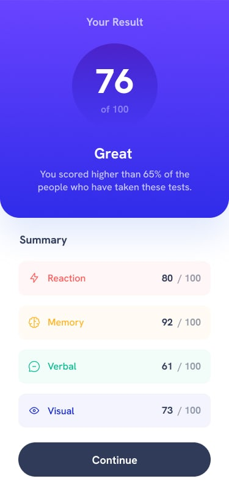
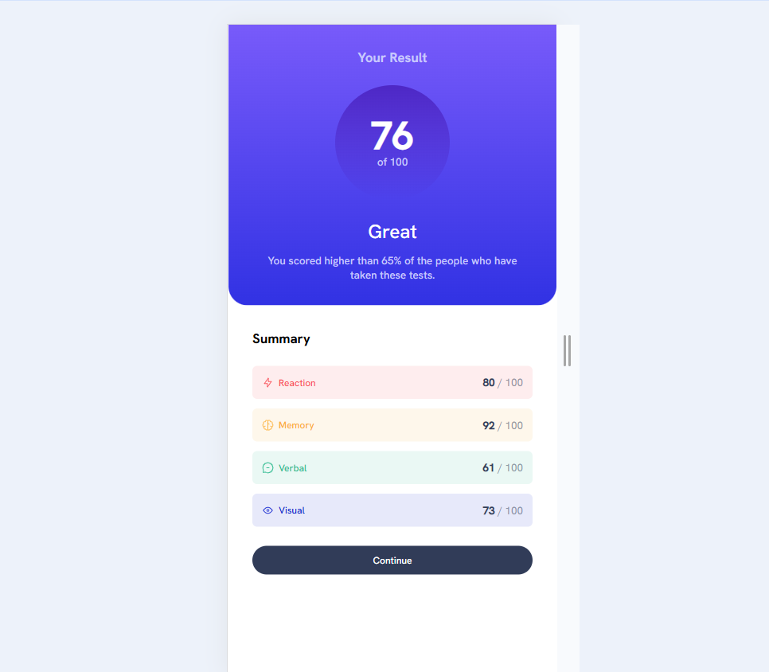

# Frontend Mentor - Results summary component solution

This is my solution to the [Results summary component challenge on Frontend Mentor](https://www.frontendmentor.io/challenges/results-summary-component-CE_K6s0maV).

## Table of contents

- [Overview](#overview)
  - [The challenge](#the-challenge)
  - [Screenshot](#screenshot)
  - [Links](#links)
- [My process](#my-process)
  - [Built with](#built-with)
  - [What I learned](#what-i-learned)
  - [Continued development](#continued-development)
  - [Useful resources](#useful-resources)
- [Author](#author)
- [Acknowledgments](#acknowledgments)

## Overview

### The challenge
This challenge involved HTML & CSS to create a responsive design of the Results Project. I have included the FrontEnd Mentor 'provided' desktop & mobile jpg overviews of the project, along with my 'completed' screenshots of both versions.

### Screenshot

### Links
- Solution URL: [Project on GitHub](https://github.com/jodideangelis/Results-Component.git)
- Live Site URL: [Netlify Live Site](https://results-challenge2.netlify.app/)

## My process

### Built with
- Semantic HTML5 markup
- CSS custom properties
- Flexbox
- CSS Grid

### What I learned
I learned quite a bit from this project.  I intentionally left my comments in my code to review while I was working on the project, which I found very helpful.  My favorite concepts were setting up & utilizing the variables, learning which spacing unit to use relative to the parent/child, using attributes (eg. data-spacing), how to create background transparency, implementing variable fonts, and learning about gradients. I took the time to follow along with Kevin Powell's Results video and learn along the way. 

### Continued development
I'd like to continue working on learning responsive web development and nesting variables more effectively.

### Useful resources
- [Kevin Powell's Results Tutorial](https://www.youtube.com/watch?v=KqFAs5d3Yl8&t=1860s) - I followed along with this tutorial and adjusted as needed. I spent time separately researching and learning concepts within this project as well. 

## Author
- Frontend Mentor - [@jodideangelis](https://www.frontendmentor.io/profile/jodideangelis)

## Acknowledgments
Shout out to the FrontEnd Mentor community!
